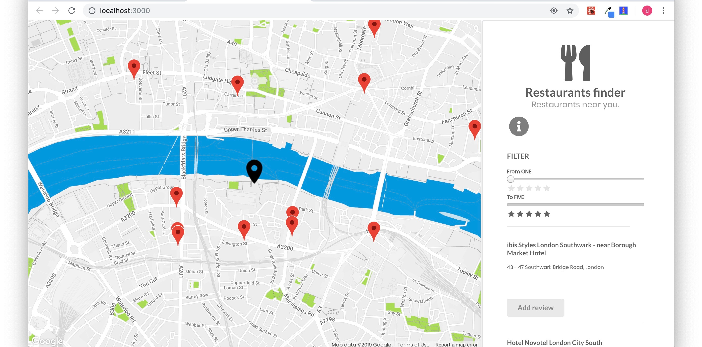

# restaurant-review-app

Launch your own restaurant review site - project7 - frontend path by openclassrooms.com

<h3> React application intergrated with Google Places API and Google Maps </h3> 

<h3> Step1: Restaurants </h3>
<ul>
  <li>a Google Maps map loaded with the Google Maps API</li>
  <li>a list of restaurants on the right side of the page that are within the area displayed on the map</li>
  <li>the Google Maps map will focus immediately on the position of the user. </li>
  <li>show restaurants on the map based on their GPS coordinates</li>
  <li>when you click on a restaurant, the list of reviews should be shown. Also show the Google Street View photo via the corresponding API! </li>
  <li>a filter tool allows the display of restaurants that have between X and Y stars. The map should be updated in real-time to show the corresponding restaurants.</li>
</ul>

<h3> Add restaurants and reviews </h3> 
<ul>
  <li>let user add a review about an existing restaurant</li>
  <li>let user add a restaurant by clicking on a specific place on the map</li>
  <li>once a review or restaurant has been added, it should appear immediately on the map. A new marker will show the position of the new restaurant.</li>

</ul>
 

<h3>  Integration with Google Places API </h3>
<ul>
  <li> use the search API to find restaurants in a particular display area</li>

</ul>

